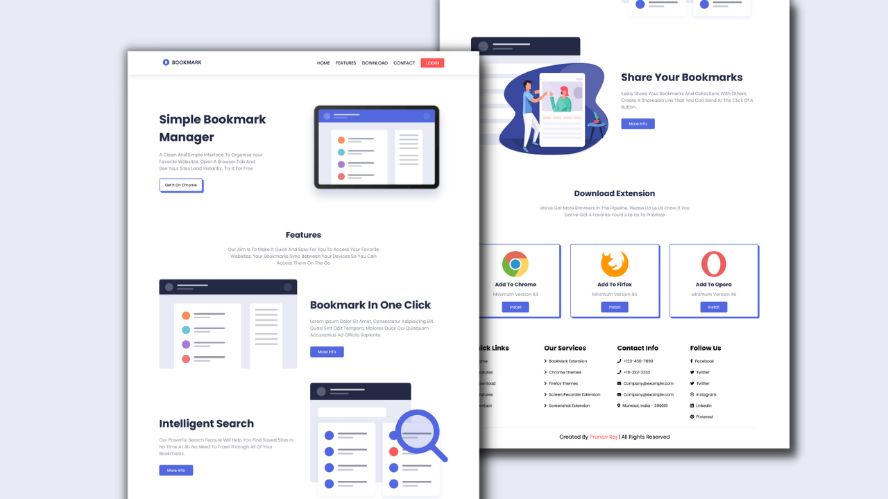

  
  <h3 align="center">Responsive-Illustration-Website</h3>

  

    Watch Complete Tutorial on YT 
     
     
     
  
  

### Complete Responsive Illustration Website Design Tutorial

- Beautiful Landing Page using HTML, CSS and JAVASCRIPT.
- Responsive Navbar With Animation
- Responsive Features Section Using Flexbox
- Responsive Downloads Section Using CSS Grid
- Compatible with all mobile devices and with a beautiful and pleasant user interface.

Subscribe the channel to see more videos like this. [Realistic Coder](https://www.youtube.com/channel/UCK5YMqyy_fjAtwgu9hjxXJg?sub_confirmation=1)

